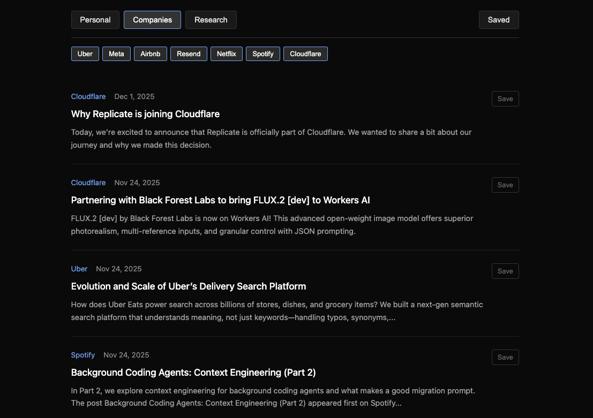

# RSS Feed Aggregator

A simple RSS feed aggregator that collects articles from various tech blogs and research sources into a single page.



## About

This is a personal project I use to keep up with news from sources I follow. It was vibe coded, most of the code was generated with LLMs. I didn't want anything complex, so it uses SQLite for storage and I keep the data in my Dropbox folder for easy syncing.

## How it works

- `npm start` fetches all sources and generates an `index.html` file, then starts a local server
- Articles are cached in SQLite for 30 minutes to avoid hammering sources
- If a fetch fails, it falls back to cached data
- Some sources use RSS feeds directly, others use custom "bridges" to scrape pages that don't have feeds

## Sources

The aggregator pulls from tech blogs (Netflix, Airbnb, Spotify, Cloudflare, etc.) and AI research pages (OpenAI, Anthropic).

## Setup

```
npm install
npm start
```

Then open `http://localhost:3030`.
